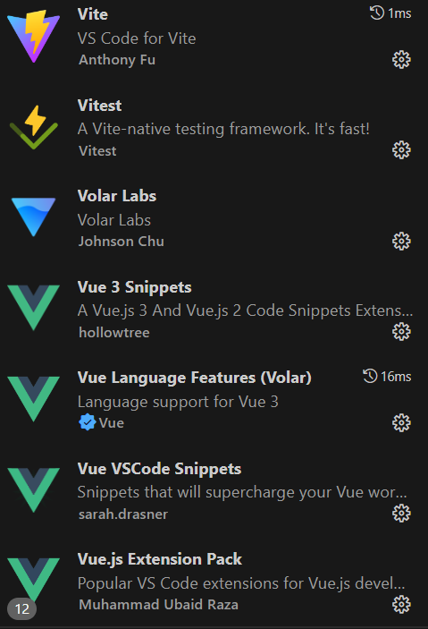

# hello-world


## How Debug?

Following,

[Creating a Project | Vue CLI](https://cli.vuejs.org/guide/creating-a-project.html)

to create the project.

then debug your project as described in 

[Debugging in VS Code — Vue.js](https://v2.vuejs.org/v2/cookbook/debugging-in-vscode.html?redirect=true)

NOTE:

(1) you need to start your project serve with `npm run serve`, then you can attach vscode debugger to the thread for code debugging.

(2) you need to install some plugins for convenience, mine is given as follows,

Vite

Vitest

Volar Labs

Vue 3 snippets

Vue vscode snippets

Vue js extension pack





## Project setup

```
yarn install
```

### Compiles and hot-reloads for development

```
yarn serve
```

### Compiles and minifies for production

```
yarn build
```

### Lints and fixes files

```
yarn lint
```

### Customize configuration

See [Configuration Reference](https://cli.vuejs.org/config/).
